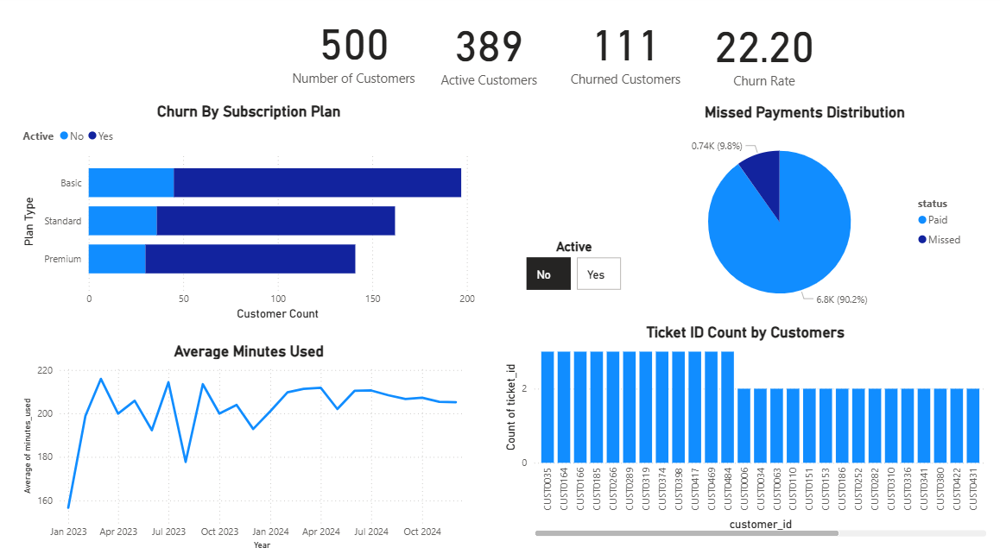

#  Customer Churn Analysis Dashboard (SQL + Power BI)

This project analyzes customer churn behavior using a simulated telecom dataset.  
It combines raw SQL analysis with an interactive Power BI dashboard to uncover insights on customer retention, payment patterns, and support engagement.

##  Project Objectives

- Identify churned vs active customer patterns
- Analyze plan-wise churn rates
- Track usage trends over time
- Visualize missed payments and support ticket volumes
- Build a clean KPI-driven dashboard with actionable metrics

##  Dashboard Preview

##  Dataset Overview

The data was **simulated for SQL practice** and contains 4 core tables:

| Table            | Description                                      |
|------------------|--------------------------------------------------|
| `customers`       | Customer profiles, plan type, active/churned    |
| `payments`        | Monthly payments with paid/missed status        |
| `usage_logs`      | Daily platform usage data (minutes, sessions)   |
| `support_tickets` | Customer complaints and resolutions             |

 All datasets are included under the `/data/` directory in `.csv` format.

##  Tools Used

- **SQL (MySQL)** — Data analysis, joins, aggregations
- **Power BI** — Visualizations, KPIs, and dashboard building
- **DAX** — Custom measure for churn rate (%)

##  Key SQL Insights

Some of the analysis performed using SQL includes:

- Monthly active vs churned breakdown
- Missed payment rate by customer
- Support ticket frequency and resolution status
- Average usage trend across time
- Churn segmentation by subscription plan

 All queries are available in [`churn_analysis.sql`](./churn_analysis.sql)

##  Key Metrics Shown

- Total Customers
- Active vs Churned Counts
- Churn Rate (%)
- Missed Payments Breakdown
- Support Tickets Per Customer
- Monthly Average Minutes Used
- Churn by Subscription Plan Type

##  License

This is a practice project using simulated data. Feel free to fork, reuse, or build upon it.

